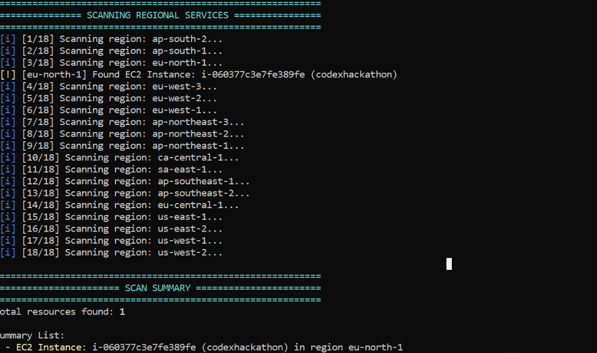
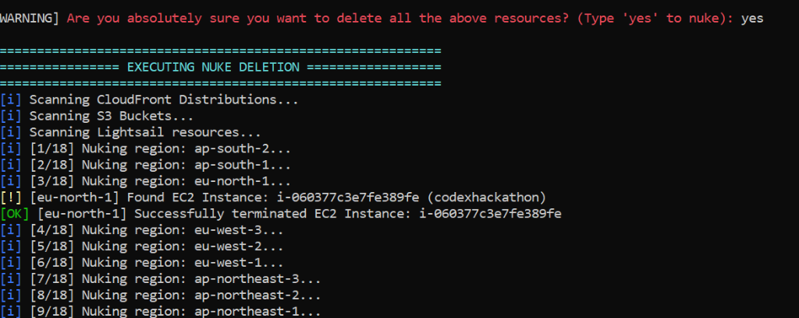

# AWS Eraser

A lightweight, unbuffered, and optimized Python script designed to scan active billing resources across all AWS regions, retrieve monthly cost savings data, and prompt the user for confirmation before performing any deletion.


## Release

**v1.0.0 – Initial Stable Release**

- Smart Cost‑Explorer handling: distinguishes `DataUnavailableException` (initialisation delay) from real permission errors and proceeds automatically.
- Added interactive banner, loading spinners, multi‑region scanning, and comprehensive permission‑warning guide.

> [!WARNING]
> This tool is highly destructive and irreversible. Confirming the terminate prompt will permanently delete resources (including databases, EC2 instances, S3 buckets, and WAF configurations) from the target AWS account. Always review the scan results and billing details before typing 'yes'.

---
## Features

* **Interactive Confirmation:** Always performs a dry-run scan first, displays the active resources, and requires an explicit 'yes' confirmation in the console before proceeding to terminate.
* **ASCII CLI Design:** Colored, text-based CLI status logs compatible across all command prompts and terminals.
* **Unbuffered Execution:** Real-time log streaming for continuous monitoring of the deletion progress.
* **Intelligent Timeout Handling:** Configured with a low connection timeout to skip disabled or opt-in regions without hanging.
* **Secure Credential Entry:** Safely prompts for AWS access keys in the terminal if no local credentials file is found, ensuring keys are not written to disk.
* **Multi-Region Coverage:** Scans all 34 active AWS regions automatically.

---

## Supported Resources

| Category | Resources Cleaned |
| :--- | :--- |
| **Compute** | EC2 Instances, Lightsail Instances, Lightsail Databases |
| **Storage** | S3 Buckets (clears all versions/objects first), EBS Volumes, RDS Databases, RDS Snapshots, RDS Automated Backups |
| **Networking** | Elastic IPs, NAT Gateways, Load Balancers (ALB/NLB/CLB), VPC Endpoints, VPN Connections, VPN Gateways, Customer Gateways, Transit Gateways |
| **Security** | WAFv2 Web ACLs (Global & Regional), CloudFront Associations |
| **Database** | DynamoDB Tables |

---

## Resources Not Cleaned (Limitations)

To prevent accidental lockouts and because of API limitations, this script does **not** delete:
* **IAM Users, Groups, Roles, & Policies:** (To avoid revoking the credentials currently running the script).
* **AWS Marketplace Subscriptions & Savings Plans:** (These are financial contracts and must be cancelled manually).
* **KMS Keys:** (Custom encryption keys require a minimum 7-day wait period before deletion).
* **Container Services:** ECS clusters, EKS Kubernetes configurations, and ECR container image registries.
* **Serverless Functions:** AWS Lambda and API Gateway deployments (though they generate no costs unless receiving traffic).
* **CloudWatch Log Groups:** (Historic system logs are preserved).

---

## Common Use Cases & Search Solutions

If you are searching Google for answers to these common AWS billing and administration problems, AWS Eraser provides a simple, direct solution:
* **How to delete all resources in AWS account before closing?** Running this script cleans up active resources across all regions so you can safely shut down your account.
* **How to stop unexpected AWS billing charges?** The script detects and deletes running instances, volumes, NAT gateways, and databases that generate active charges.
* **How to nuke AWS account using Python Boto3?** This project is a complete, single-file script wrapper around `boto3` to automate AWS account purges.
* **AWS Cost Explorer shows unexpected fees, how to clean up?** The script displays your exact dashboard bill and highlights what active services are causing the charges.

---

## Getting Started

### 1. Installation

Clone this repository and install the official AWS SDK (boto3):

```bash
git clone https://github.com/abhinandnm/aws-eraser.git
cd aws-eraser
pip install -r requirements.txt
```

### 2. Usage

Run the script on Windows using the batch file:
Double-click `run.bat` or execute in the terminal:
```bash
python aws_eraser.py
```

### 3. Execution Flow
1. The script checks for a local `credentials.json` file. If not found, it prompts the user to enter their AWS Access Key ID and Secret Access Key.
2. It fetches and displays the current monthly accrued bill grouped by service.
3. It scans all 34 regions and outputs the list of active billing resources.
4. It prompts: `[WARNING] Are you absolutely sure you want to delete all the above resources? (Type 'yes' to nuke): `.
5. If the user inputs 'yes', the script runs the deletion sequence. Any other input exits safely.



#### 4. Active Resource Termination Output


---

## Troubleshooting Cost Explorer Access

If the script shows an `Access Denied or Cost Explorer disabled` warning even after attaching the IAM policy, follow these two steps to activate billing access:

1. **Activate IAM Billing Access (Must be done by the AWS Root Account):**
   * Sign in to the AWS Console as the **Root User** (using the primary email address of the account, not an IAM user).
   * Open the [AWS Account Settings Page](https://console.aws.amazon.com/billing/home?#/account).
   * Scroll down to the **IAM User and Role Access to Billing Information** section and click **Edit**.
   * Check the box for **Activate IAM Access** and click **Update**.

2. **Attach the IAM Policy:**
   * Open the [IAM Users Console](https://console.aws.amazon.com/iam/home?#/users).
   * Select your target IAM user/role, click **Add Permissions**, and search for the AWS managed policy **`AWSBillingReadOnlyAccess`**.
   * Attach it to the user.

> **Note:** When the script detects a `DataUnavailableException`, it will display an informational message that Cost Explorer is still initializing and will automatically continue scanning resources without aborting. No policy changes are required in that case; just wait up to 24 hours for billing data to become available.

1. **Activate IAM Billing Access (Must be done by the AWS Root Account):**
   * Sign in to the AWS Console as the **Root User** (using the primary email address of the account, not an IAM user).
   * Open the [AWS Account Settings Page](https://console.aws.amazon.com/billing/home?#/account).
   * Scroll down to the **IAM User and Role Access to Billing Information** section and click **Edit**.
   * Check the box for **Activate IAM Access** and click **Update**.

2. **Attach the IAM Policy:**
   * Open the [IAM Users Console](https://console.aws.amazon.com/iam/home?#/users).
   * Select your target IAM user/role, click **Add Permissions**, and search for the AWS managed policy **`AWSBillingReadOnlyAccess`**.
   * Attach it to the user.

---

## Contributing

Contributions are welcome. Please open an issue or submit a pull request if you want to add support for more AWS resource types.

## License

This project is licensed under the MIT License.
